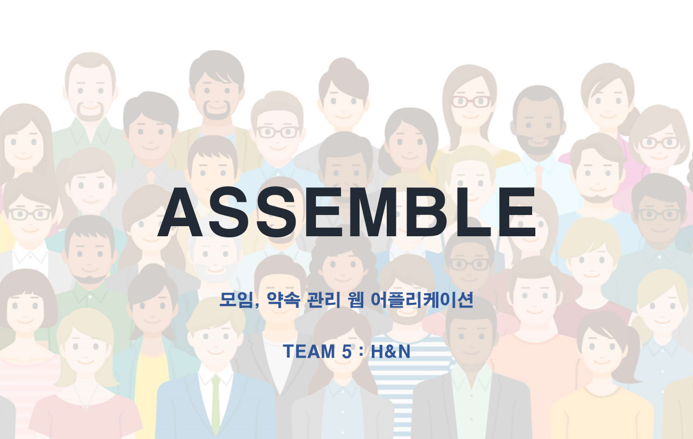
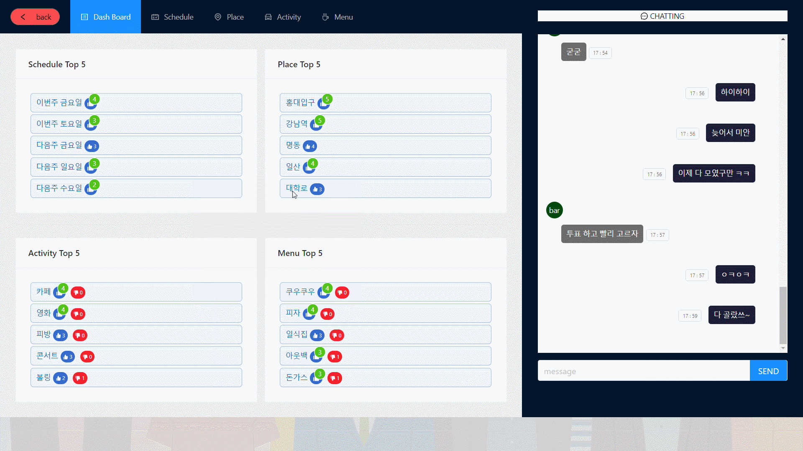
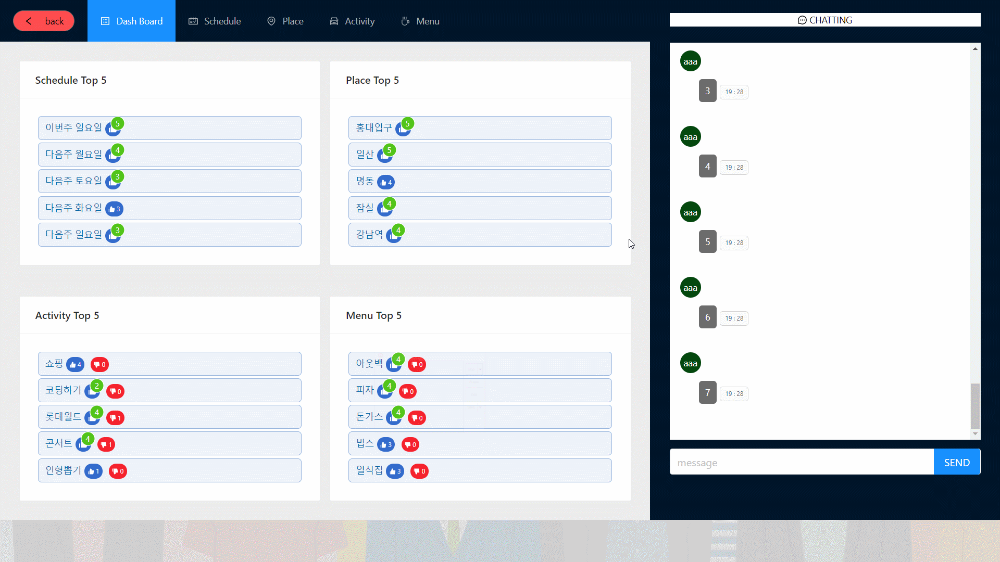
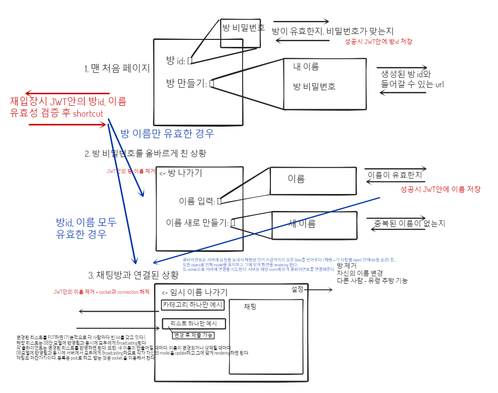

# **Assemble-server**

## **Team 5. H&N (Here And Now)**



<hr>

## **Team Member**
- ### **윤성경** 
- ### **송성현**
- ### **노영민**

<hr>

## **DEMONSTRATION | 시연 영상**

<br>

## **1. 방 생성**


<hr>

## **2. 방 입장**


<hr>

## **3. 유저 생성**


<hr>

## **4. 유저 입장**


<hr>

## **5. 대시 보드**

#### ***자신이 선택했던 항목들은 강조되어 표시됩니다.***
<hr>

## **6. 일정 탭 (항목 추가, 항목 변경, 변경내용 유지, 변경내용 제출)**

#### ***자신이 추가, 변경한 내용은 실시간으로 다른 사람의 변경사항이 추가되더라도 그대로 유지됩니다.***
#### ***자신이 선택했던 항목들은 강조되어 표시됩니다.***
<hr>

## **7. 장소 탭 (항목 변경, 변경내용 취소)**

#### ***자신이 선택했던 항목들은 강조되어 표시됩니다.***

<hr>

## **8. 활동 탭 (항목 변경, 변경내용 유지, 변경내용 제출)**

#### ***자신이 추가, 변경한 내용은 실시간으로 다른 사람의 변경사항이 추가되더라도 그대로 유지됩니다.***
#### ***자신이 선택했던 항목들은 강조되어 표시됩니다.***

<hr>

## **9. 메뉴 탭 (항목 추가, 항목 변경, 변경내용 취소)**

#### ***자신이 선택했던 항목들은 강조되어 표시됩니다.***

<hr>

## **10. 채팅**


<hr>

## **일정과 진행상황 설명**

<hr>

- #### **Backend**

#### 2020-01-14 ~ 2020-01-15 : server build와 basic structure 생성, API 초안 작성
#### 2020-01-16 : Socket.io를 이용한 기본적 서버 API와 기능 90% 이상 완성
#### 2020-01-20 : 버그 패치 + 모든 기능 완성
#### 2020-01-23 : 공식 프로젝트 일정 종료. 서버는 AMAZON EC2에, 클라이언트는 AMAZON S3 Bucket에 배포. 

<hr>

- #### **Frontend**

#### 2020-01-14 ~ 2020-01-17 : 새로운 stack 공부 - Redux, Redux thunk, Ant design
#### 2020-01-14 ~ 2020-01-19 : 기본적인 클라이언트 구조 prototyping, 프로토타입 중에 메인 프로토타입 선택
#### 2020-01-20 ~ 2020-01-21 : Ant design 없이 Redux만으로 기능 90% 이상 완성
#### 2020-01-22 : Ant design 적용
#### 2020-01-23 : 공식 프로젝트 일정 종료. 서버는 AMAZON EC2에, 클라이언트는 AMAZON S3 Bucket에 배포. 

<hr>

### **( 2020-01-23 기준 ) 접속 주소 <br> http://assemble-client.s3-website-us-east-1.amazonaws.com/**

<hr>

## **프로젝트 메인 컨셉과 기획, 구조 설명**

<hr>

#### **초기 컨셉** <br>Assemble은 모임을 잡을 때 여러 사람들의 의견을 모아 결정하는 과정을 도와주는 간편한 Web App입니다. <br> <br> 참여자마다 각각 다른 여유 시간과 일정 정보들을 모아서 최대한 많은 사람들이 모일 수 있도록 최선의 모임 시간을 찾아냅니다. <br> <br> 또한 모임의 활동 내용과 식사 정보에 대한 참여자들 개인의 선호, 불호 여부를 결정에 반영해서 모두에게 만족스러운 의사 결정을 효율적으로 할 수 있도록 돕습니다. <br> <br> 참여자가 위치 정보를 지도 위에 표시해서 공유할 수 있는 기능을 제공해서 모두가 직관적으로 만날 장소를 고를 수 있게 해주고, 모임 장소까지 걸리는 시간을 파악하거나, 모임 장소와 가까운 맛집을 찾는 일을 도와줍니다.  <br> <br> 또한 약속 날짜에 볼 수 있는 영화를 확인하고, 당일 날씨나 미세먼지 정보를 쉽게 찾아볼 수 있는 디테일한 기능에 더해서 실시간 채팅과 투표 기능을 통해서 빠르고 효과적인 의사 결정을 지원합니다. <br> <br> 마지막으로 모임이 끝난 이후, 비용을 정산하는 문제까지도 한번에 해결할 수 있도록 더치페이 계산기를 지원하고 있습니다.  <br> <br> 모임에서 다같이 찍은 사진을 모두에게 공유하는 일도 사진 게시판을 이용하면 아무 문제 없습니다. <br> <br> 모임의 시작부터 끝까지 책임지는 Assemble은 현재는 외부 API에만 의존하고 있지만, 자체 서비스로 추천, 광고 방식의 수익 모델을 도입한다면 경쟁력 있는 Win Win 솔루션이 될 것입니다.  <br> 
<hr>

### **High Level Object** : 모임, 약속시 일정, 장소, 활동, 메뉴 결정에 참여자의 각각 다른 의견을 모두 반영한 **직관적인 실시간 투표를 제공해서 효과적인 의사결정을 돕는 Web Application** 

### **프로젝트 기간 제한** : 2020-01-13 [ **프로젝트 시작** ] ~ 2020-01-23 [ **프로젝트 발표** ] 

<hr>

### **예상 USE CASE**

#### < minimum requirement > DEVELOPMENT COMPLETE
- #### 1. 그룹 채팅방을 생성한다 *(방 생성시 방 이름과 비밀번호를 입력하면 방의 id를 받게 된다.)*  
- #### 2. 카카오톡 등의 메신저를 통해서 모임 참여자들에게 id와 비밀번호를 공유하면 각각 방에 들어와서*(참여자 등록은 안한 상태)* 방 참여자 이름을 등록하고 그룹 공간에 입장한다.
- #### 3. 한번 인증한 이후에는 다시 들어올 때 인증할 필요가 없다.
- #### 4. 그룹 채팅방에 제공되는 일정/장소/활동/메뉴 별 실시간 투표 기능으로 모두의 의견을 제출하고 *(각각의 의견에 좋아요, 싫어요 등을 누를 수 있고 새 의견을 제출할 수도 있다.)* 모든 메뉴의 진행 상황을 한눈에 볼 수 있는 대시보드로 전체 투표 현황을 직관적으로 확인할 수 있다. 또한 채팅방을 통해서 구체적인 의사소통이 가능하며, 채팅방은 항상 보면서 의사소통할 수 있다. *(화면 일부에 고정시킨다.)*

#### < challenging requirement > NOT DEVELOPED YET, BUT CHARMING
- #### 5. 일정은 캘린더나 시계를 보면서 가능한 시간들을 선택하고 투표 결과를 확인할 수 있다. 장소는 맵을 보면서 특정 지역을 선택하고, 투표 결과가 지도 위에 보이므로 직관적이다.(upgrade UI)
- #### 6. 다양한 주제와 방식의 Custom 투표를 생성하고 사용할 수 있다. 
- #### 7. 온라인인 사람 표시하기 - 어렵지는 않지만 중복 로그인 관련 issue 등 여러가지 구현 방식이 있을 수 있다.
- #### 8. 선택한 위치(+시간) 기준으로 출발지부터 도착지까지 경로 + 예상시간 을 볼 수 있다. (외부 API 연결) 
- #### 9. 선택한 위치(+시간) 기준으로 주변 맛집 탐색, 추천 기능을 쓸 수 있다. (외부 API 연결)
- #### 10. 선택한 시간(+위치) 기준으로 날씨, 미세먼지 정보, 상영 영화 등의 정보를 볼 수 있다. (외부 API 연결)
- #### 11. 사진 게시판에 모임 당일 찍은 사진을 공유할 수 있다.
- #### 12. 모임 당일의 정산 정보를 관리할 수 있고, 더치페이 계산기를 통해서 각각 내야 할 돈을 바로 볼 수 있다.
- #### 13. 스마트폰 Application으로 사용할 수 있다.
- #### 14. 카카오톡 초대기능 등으로 더 간편하게 사용할 수 있다. 
- #### 15. 카카오페이 더치페이 기능등을 연동해서 이용할 수 있다.
- #### 16. 모임 내에서 인기있었던 맛집, 메뉴, 영화, 장소, 키워드 등을 실시간 급상승 목록으로 보여주고, 추천 서비스도 제공해준다. (수익모델 - 실제 의사결정 상황에서 사용자들과 밀접하게 상호작용하며 편의를 제공하기 때문에 이벤트 홍보 등에 효과적이다.)


<hr>

### **Tech Stack** : <br><br> [ **Server Side** ]에는 짧은 기한에 맞게 **안정적이고 빠른 개발**을 위해서 이미 **익숙하고 디버깅, 이슈 해결에 자신이 있는** **Node.js**와 **express**를 이용해서 서버를 구성했고, <br> 개발 초기에 자주 생길 수 있는 **변경사항에 빠르게 대응하고 실시간 처리에 맞는 성능을 보장**하기 위해서 **자유로운 형식을 지원하며 대용량 데이터 처리에 적합**한 NoSQL 타입의 데이터베이스인 **Firebase - FireStore**를 사용했습니다. <br> **실시간 웹 서비스**를 위해서 **Socket.io**를 사용했습니다. <br><br> [ **Client Side** ]에는 **클라이언트의 복잡한 상태와 구조를 효율적이고 간단하게 처리**하기 위해서 **상태 처리를 한 장소에서 단방향으로 진행하게 도와주는 Redux**와 <br> **안정적이고 빠른 개발**을 위해 이미 **익숙하고 디버깅, 이슈 해결에 자신이 있으며 효율적인 클라이언트 처리를 통해 반응성이 높은 React**를 이용해서 클라이언트 구조를 잡았고, <br>  **빠르고 쉽게 사용자가 만족할만한 퀄리티의 UI를 제공**하기 위해 **Ant Design**을 사용해서 디자인을 구성했습니다.  <br> **실시간 웹 서비스**를 위해서 **Socket.io**를 사용했습니다. 

<hr>

## **실시간 소통을 위한 구조 선택 issue와 각 구조에 대한 장/단점**
### **상황**: 각 참여자가 [일정, 장소, 활동, 메뉴] 에 대한 투표목록을 갖는다. 채팅은 따로 방에 속한 것으로 한다. *(간단한 채팅 기능으로 충분하므로 참여자에 종속시키지 않고 방에 전체 채팅 목록을 종속시킨다.)* <br> 클라이언트는 실시간으로 모든 사람의 총 투표 결과를 확인할 수 있다. ex: "월요일 3시"에 몇명이 괜찮다고 했는지, "볼링 치기"에 몇 개의 좋아요와 싫어요가 있는지 실시간으로 확인
### 기본적으로 새로운 **입력 요청은 형식에 맞게 보내기 위해 일반 REST API로 보낸 후, 변경 사항은 실시간성을 위해서 해당 방의 참여자들에게 Socket.io로 전달**된다. 
## **구조 1. 서버에서 방마다 모델(총 투표 정보) 유지 + 변경내용 발생 시 유지하고 있던 모델 기반으로 변경된 내용 클라이언트에 전달**
- ### 클라이언트는 **맨 처음 들어올 때 자신의 방의 뷰를 서버에서 가져와서 렌더링**한다. <br>서버는 실시간으로 **모든 방의 상태를 방 별로 서버 안 모델에 저장해서 유지**하고, 클라이언트와 실시간으로 상호작용하면서 **직전 모델에서 변경사항을 해당 방의 클라이언트들에게 전달**해준다. <br> **<장점>**: 클라이언트는 **서버에 자신의 입력만을 전달**하고, 서버에서 **변경사항이 들어오면 그대로 변경해서 렌더링**하면 되기 때문에 **클라이언트 구현이 쉽다.** <br> **사용자가 적고, 방의 수가 적은 상황이 보장되고 활발한 방들만 있다는 전제 하에** 클라이언트와 서버 모두 **구현하기 쉽고, 통신 양이 적어서 가장 효율적**이다. <br> **<단점>**: **방의 개수가 많고, 활발하지 않은 방의 비율이 높은 경우**, 서버 안에 모든 방의 정보를 항상 저장해야 하기 때문에 **비효율적이고 서버의 부담이 커져서 Scalable하지 않다.** <br> **따라서 많은 방을 지원해야 하고, 항상 활발한 방의 비율이 높지 않은 ASSEMBLE에는 적절하지 않은 구조**이다.
## **구조2. 서버에서 변경사항 발생시마다 DB에서 모델을 계산해서 변경된 내용 클라이언트에 전달**
- ### 클라이언트는 **맨 처음 들어올 때 자신의 방의 모델을 서버에서 가져와서 렌더링**한다. <br>**모든 방의 상태는 방 별로 데이터베이스 안의 모델에 저장**해놓고, 클라이언트가  요청을 보내면, **요청을 받았을 때만 데이터베이스 안에 있는 해당 방의 모델을 수정하고 변경사항을 해당 방의 클라이언트들에게 전달**해준다. <br> **<장점>**: 클라이언트는 **서버에 자신의 입력만을 전달**하고, 서버에서 **변경사항이 들어오면 그대로 변경해서 렌더링**하면 되기 때문에 **클라이언트 구현이 쉽다.** <br> **방의 개수가 많고, 활발하지 않은 방의 비율이 높은 경우**, 방이 아무리 많더라도 **모든 방의 상태를 서버가 유지할 필요가 없어서 부담이 적고 확장성이 높아진다.** <br> **<단점>**: **일시적으로 트래픽이 높아지는 상황에서 매번 클라이언트가 입력을 요청할 때마다 변경사항을 찾기 위해서 테이블을 조인해서 부분적으로 모델을 완성 하는 과정을 반복해야 하므로 비효율적이다.** <br> **따라서 항상 요청이 균일하게 주기적으로 오는 것이 아니라, 참여자들이 모임을 갖는 순간에 폭발적으로 증가하는 ASSEMBLE에는 최적의 구조는 아니다.**
## **구조3. 클라이언트에서 모델 유지, 서버에서는 변경사항을 추가 처리 없이 클라이언트에 전달 후 클라이언트에서 새로운 모델 계산**
- ### 클라이언트는 **맨 처음 들어올 때 자신의 방의 모델을 서버에서 가져와서 렌더링**한다. <br>**자신이 속한 방의 상태를 클라이언트가 최신 모델로 유지**하며, 입력이 생기면 클라이언트가 자신의 입력을 서버에 제출한다. <br> 입력을 받은 서버는 해당 참여자의 **입력(새 투표 목록)을 데이터베이스에 덮어쓰기**만 하며 **입력 내용을 그대로 해당 방의 다른 클라이언트에게 전달**한다. <br> 클라이언트는 **변경사항을 받을 때마다 자신이 유지하는 모델을 업데이트하며 새 모델을 렌더링한다**. <br> **<장점>**: **방이  많아지더라도, 방이 순간적으로 활발하게 운영되더라도 서버와 데이터베이스에 미치는 부담이 최소화된다**. *(또한 데이터베이스에 매 입력마다 쓰는 작업이 부담스러울 정도로 입력 수가 많고 주기가 짧을 경우 모델의 Reliability를 희생하면서 입력을 버퍼링 시켜서 데이터베이스에 제출하면 효율적으로 대규모 입력을 처리할 수 있다.)* <br> **<단점>**: 클라이언트가 모델을 유지하고 관리해야 하는 책임이 생기기 때문에 **클라이언트 구현이 어려워지고, 모든 클라이언트가 동일한 작업을 한다는 비효율성이 생긴다.** *(클라이언트가 다뤄야 할 모델이 크고 복잡하다는 상황에서는 이런 비효율성이 문제가 될 수 있다. 하지만 같은 그룹끼리 같은 처리를 한다는 점을 이용해서 같은 그룹끼리 묶어서 분산처리를 한다면 이 문제도 충분히 해결할 수 있다.)* <br> **따라서 클라이언트 구현이 어려워지긴 하지만, ASSEMBLE의 사용 환경에 최적의 구조인 구조 3을 사용하게 되었다.** 
### **COMMENT - 프로젝트 USE CASE에 최적인 3번 구조를 선택했고, 이 구조에는 클라이언트 구현 난이도가 높은 단점이 있다. <br> 서버를 빠르게 완성하고 남은 시간을 클라이언트 구현에 사용하면 충분할 것이라고 설계 당시 예상했지만, 클라이언트에 새로 도입한 기술 이해와 함께 모델 관리를 10일이라는 시간 정도에 여유롭게 구현하기에는 구현 난이도가 높은 편이었다. 이 결정 때문에 모두 고생했고, 10일 제한의 프로젝트를 진행하는 프로젝트 관리 측면에서는 1번이나 2번 구조를 선택하는 것이 더 나은 선택이었을 것 같다.** 

<br>
<hr>

# **API Overview**
### **API 생성에 참고한 API Overview 초안이다.**


<br>

# **Backend API**

## **rooms (TO SERVER)**

<hr>

- #### **POST /rooms** 
##### 설명 : 새로운 방을 만든다. 방장의 이름과 방의 입장 비밀번호를 제출하면, 새로운 방의 생성된 id를 응답으로 받는다. (code:201)
##### 사용하는 상황 : 새로운 방을 만들 때 사용한다.
``` 
req body  
{
    password: String,
    name: String
}
res body
{
    id: String
}
```
<hr>

- #### **POST /rooms/:room_id** 
##### 설명 : room_id에 해당하는 방에 새로 입장을 요청한다. 비밀번호가 맞다면 status code: 200을, 틀리다면 status code: 401을 응답으로 받는다. 방이 존재하지 않으면 status 404를 받는다. 정상 응답시 쿠키로 room에 JWT를 등록하고, body 안에도 JWT를 첨부한다.
##### 사용하는 상황 : 방에 입장을 시도할 때 사용한다.
``` 
req body  
{
    password: String,
}
res body
{
    token: JWT
}
```

<hr>

- #### **DELETE /rooms/:room_id** 
##### 설명 : room_id에 해당하는 방에 삭제 요청을 보낸다. 삭제 후 response로 status code: 200을 받는다.
##### 사용하는 상황 : 방을 삭제할 때 보내는 요청이다.
- #### **GET /rooms/memory** 
##### 설명 : JWT에 저장된 방 id와 이름을 응답으로 가져온다. JWT의 방 id, 이름은 유효한 경우에만 가져온다.
##### 사용하는 상황 : 갖고 있는 JWT를 이용해서 클라이언트가 재접속 시에 기억하고 있는 방, 이름에 자동으로 연결을 요청하기 위해서 사용한다.
``` 
res body
{
    room_id: String
    name: String
}
```

<hr>

- #### **GET /rooms/:room_id/model** 
##### 설명 : room_id에 해당하는 방의 전체 모델을 가져온다. 방의 chatting 목록과 함께 모든 이름 object와 그 안의 list들을 가져온다. (code: 200)
##### 사용하는 상황 : 채팅방에 접속할 때 클라이언트에 전체 모델을 set up 하기 위해 사용한다.
``` 
res body
{
  "room_id": String,
  "password": String,
  "roomname": String,
  "payment_list": [],
  "people": [
    {
      "menu_list": [],
      "name": String,
      "activity_list": [],
      "avail_places_list": [],
      "avail_schedules_list": []
     }, ...
  ],
  "chats": [
     {
       id: Number,
       author_name: String, 
       content: String, 
       created_at: JSON Date
     }, ...
  ]
}
```

<hr>

- #### **GET /rooms/room_id/disconnect** 
##### 설명 : room_id에 해당하는 방에서 연결을 끊는다. JWT안의 방 정보가 지워지므로 이후 동일 방에 들어가려면 비밀번호를 입력해야 한다. response로 status code: 200을 보낸다. 토큰의 기억하고 있는 방 정보가 지워진다.
##### 사용하는 상황 : 이름 입력화면에서 메인 페이지로 나올 때 보내는 요청이다.

<hr>

- #### **GET /rooms/:room_id/people/disconnect?socket_id=\<socketId\>** 
##### 설명 : room_id에 해당하는 방에서 유저 연결을 끊는다. 이후 해당 방에서 동일 이름으로 들어가려면 이름을 입력해야 한다.status code: 200을 보낸다. 토큰의 기억하고 있는 방-이름 정보가 지워진다. socket으로 disconnect 요청 message를 보낸다. ```io.to(socket_id).emit("drop", "")```
##### 사용하는 상황 : 채팅방에서 이름 입력화면으로 나올 때 보내는 요청이다.

<hr>

- #### **GET /rooms/:room_id/people/:name**
##### 설명 : room_id에 해당하는 방에 참여하는 사람 중에 name에 해당하는 사람이 있는지 조회한다. 이미 존재한다면 code: 200을 존재하지 않는다면 code: 404를 보낸다.
##### 사용하는 상황 : 이미 이름이 존재하는지 확인할 때 보내는 요청이다. (재입장)

<hr>

- #### **POST /rooms/:room_id/people**
##### 설명 :room_id에 해당하는 방에 새로운 이름 name을 추가한다. 이미 중복된 이름이 존재한다면 code: 409를, 새로운 이름을 추가하는데 성공했다면  (해당 방에 연결된 모두에게 socket.io로 해당 내용을 broadcast한 다음) code:201을 보낸다.
##### 사용하는 상황 : 해당 채팅방에 새 이름을 등록할 때 보내는 요청이다.
``` 
req body
{
    name: String
}
```

<hr>

- #### **DELETE /rooms/:room_id/people/:name**
##### 설명 :room_id에 해당하는 방에 참여하는 사람 중에 name에 해당하는 사람의 정보를 삭제한다. 삭제 이후 (해당 방에 연결된 모두에게 socket.io로 해당 내용을 broadcast한 다음) response로 code: 200을 보낸다. 
##### 사용하는 상황 : 추방 기능, 유령 회원 삭제 기능 등에 쓰인다.

<hr>

- #### **POST /rooms/:room_id/chats**
##### 설명 :room_id에 해당하는 방에 채팅을 보낸다. (해당 방에 연결된 모두에게 socket.io로 해당 내용을 broadcast하고) 해당 채팅을 DB에 등록한 후 code: 201을 보낸다.
##### 사용하는 상황 : 채팅 기능에 쓰인다.
``` 
req body
{
    content: String
}
```

<hr>

- #### **PUT /rooms/:room_id/people/:name/avail_schedules_list**
##### 설명 :room_id에 해당하는 방 내에 있는 name의 이름을 갖고 있는 사람의 가능 일정 목록을 변경한다. (맨 처음 제출이라도 PUT에 해당한다. 아이디를 생성할 때 빈 리스트가 생기기 때문이다.) (해당 방에 연결된 모두에게 socket.io로 해당 내용을 broadcast하고) 해당 리스트를 DB에 등록한 후 code: 201을 보낸다.
##### 사용하는 상황 : 가능한 일정 의견을 보내는 데 쓰인다.변경사항이 있는지 여부는 클라이언트에서 검증한다.
``` 
req body
{
   avail_schedules_list: [
    {
        content: String
     }, 
     ...
  ]
}
```

<hr>

- #### **PUT /rooms/:room_id/people/:name/avail_places_list**
##### 설명 :room_id에 해당하는 방 내에 있는 name의 이름을 갖고 있는 사람의 가능 장소 목록을 변경한다. (맨 처음 제출이라도 PUT에 해당한다. 아이디를 생성할 때 빈 리스트가 생기기 때문이다.) (해당 방에 연결된 모두에게 socket.io로 해당 내용을 broadcast하고) 해당 리스트를 DB에 등록한 후 code: 201을 보낸다.
##### 사용하는 상황 : 가능한 장소 의견을 보내는 데 쓰인다. 변경사항이 있는지 여부는 클라이언트에서 검증한다.
``` 
req body
{
   avail_places_list: [
    {
        content: String
     }, 
     ...
  ]
}
```

<hr>

- #### **PUT /rooms/:room_id/people/:name/activity_list**
##### 설명 :room_id에 해당하는 방 내에 있는 name의 이름을 갖고 있는 사람의 활동 목록을 변경한다. (맨 처음 제출이라도 PUT에 해당한다. 아이디를 생성할 때 빈 리스트가 생기기 때문이다.) (해당 방에 연결된 모두에게 socket.io로 해당 내용을 broadcast하고) 해당 리스트를 DB에 등록한 후 code: 201을 보낸다.
##### 사용하는 상황 : 선호/비선호 활동 의견을 보내는 데 쓰인다. 변경사항이 있는지 여부는 클라이언트에서 검증한다.
``` 
req body
body(JSON):
{
  activity_list: [
    {
        content: 내용, 
        isFavor: 호/불호 여부(boolean)
     },
     ...
  ]
}
```

<hr>

- #### **PUT /rooms/:room_id/people/:name/menu_list**
##### 설명 :room_id에 해당하는 방 내에 있는 name의 이름을 갖고 있는 사람의 메뉴 목록을 변경한다. (맨 처음 제출이라도 PUT에 해당한다. 아이디를 생성할 때 빈 리스트가 생기기 때문이다.) (해당 방에 연결된 모두에게 socket.io로 해당 내용을 broadcast하고) 해당 리스트를 DB에 등록한 후 code: 201을 보낸다.
##### 사용하는 상황 : 선호/비선호 메뉴 의견을 보내는 데 쓰인다. 변경사항이 있는지 여부는 클라이언트에서 검증한다.
``` 
req body
body(JSON):
{
   menu_list: [
    {
        content: 내용, 
        isFavor: 호/불호 여부(boolean)
     }, 
     ...
  ]
}
```

<hr>

- #### **IO.CONNECT /?roomId=방id&name=이름**
##### 설명 : Socket.io에 room으로 join 요청을 보낸다.
##### 사용하는 상황 : 채팅방에 유저를 접속시킬 때 사용한다.

<hr>

## **SOCKET RESPONSE (TO CLIENT)**

<hr>

- #### **"drop"**
##### 설명 :같은 방에 있는 socket들에게 보낸다. 
##### 사용하는 상황 : 채팅방의 유저들에게 방이 종료되므로 연결을 끊어달라는 요청을 보낸다.
```io.to(room_id).emit("drop", "")```

<hr>

- #### **"chat message"**
##### 설명 :같은 방에 있는 socket들에게 보낸다. 
##### 사용하는 상황 : 채팅방에 새로 등록된 채팅 메시지를 공지한다.
```io.to(room_id).emit("chat message", body)```
```
body
{ 
  id: created_at,
  author_name: author_name,
  content: content,
  created_at: created_at
}
```

<hr>

- #### **"new person"**
##### 설명 :같은 방에 있는 socket들에게 보낸다. 
##### 사용하는 상황 : 채팅방에 새로운 유저가 생겼음을 알릴 때 사용한다.
```io.to(room_id).emit("new person", body)```
```
body
{
  name: name,
  avail_schedules_list: JSON.stringify([]),
  avail_places_list: JSON.stringify([]),
  activity_list: JSON.stringify([]),
  menu_list: JSON.stringify([])
}
```

<hr>

- #### **"delete person"**
##### 설명 :같은 방에 있는 socket들에게 보낸다. 
##### 사용하는 상황 : 채팅방에 유저가 삭제되었음을 알릴 때 사용한다. (만약 자신이 해당 유저라면 연결을 끊는다.)
```io.to(room_id).emit("delete person", name)```

<hr>

- #### **"new schedule_list"**
##### 설명 :같은 방에 있는 socket들에게 보낸다. 
##### 사용하는 상황 : 채팅방에 어떤 사람의 일정 목록이 update 되었음을 알릴 때 사용한다. 클라이언트가 같은 메시지를 두번 처리하는 문제를 방지하기 위해 name과 발송 시간에 의해 고유하게 만들어지는 id를 같이 전송한다. 
```io.to(room_id).emit("new schedule_list", body)```
```
body
{
  id: <double message를 방지하기 위한 id>,
  name: name,
  avail_schedules_list: schedule_list
}
```

<hr>

- #### **"new place_list"**
##### 설명 :같은 방에 있는 socket들에게 보낸다. 
##### 사용하는 상황 : 채팅방에 어떤 사람의 장소 목록이 update 되었음을 알릴 때 사용한다. 클라이언트가 같은 메시지를 두번 처리하는 문제를 방지하기 위해 name과 발송 시간에 의해 고유하게 만들어지는 id를 같이 전송한다. 
```io.to(room_id).emit("new place_list", body)```
```
body
{
  id: <double message를 방지하기 위한 id>,
  name: name,
  avail_places_list: place_list
}
```

<hr>

- #### **"new activity_list"**
##### 설명 :같은 방에 있는 socket들에게 보낸다. 
##### 사용하는 상황 : 채팅방에 어떤 사람의 활동 목록이 update 되었음을 알릴 때 사용한다. 클라이언트가 같은 메시지를 두번 처리하는 문제를 방지하기 위해 name과 발송 시간에 의해 고유하게 만들어지는 id를 같이 전송한다. 
```io.to(room_id).emit("new activity_list", body)```
```
body
{
  id: <double message를 방지하기 위한 id>,
  name: name,
  activity_list: activity_list
}
```

<hr>

- #### **"new menu_list"**
##### 설명 :같은 방에 있는 socket들에게 보낸다. 
##### 사용하는 상황 : 채팅방에 어떤 사람의 메뉴 목록이 update 되었음을 알릴 때 사용한다. 클라이언트가 같은 메시지를 두번 처리하는 문제를 방지하기 위해 name과 발송 시간에 의해 고유하게 만들어지는 id를 같이 전송한다. 
```io.to(room_id).emit("new menu_list", body)```
```
body
{
  id: <double message를 방지하기 위한 id>,
  name: name,
  menu_list: menu_list
}
```

<br>
<hr>

# **Database Schema : firebase-firestore 기준**

<br>


## **rooms** 
<br>

``` 
{
  room_id: String, 

  room_name: String,

  room_pwd: String, 

  people: <collection>,

  chats: <collection>,

  payment_list: Stringify(list_of_contents)

}
```
<br>
<hr>

## **people** 
<br>

``` 
{
  name : String,

  avail_schedules_list: Stringify(list_of_contents),

  avail_places_list: Stringify(list_of_contents),

  activity_list: Stringify(list_of_contents),

  menu_list: Stringify(list_of_contents)
}
```
<br>
<hr>

## **chats** 
<br>

``` 
{

  id: String,

  author_name: String, 

  content: String, 

  created_at: firebase.firestore.Timestamp 

}
```
<br>
<hr>

# dev log
- ### **2020-01-14: 테스트 프레임워크인 mocha를 이용해서 비동기 요청을 테스트 하는 방법을 직접 해보면서 배웠다.**
- ### **2020-01-15: API를 user scenario를 통해 직접 만들어보면서 문서의 중요성과 생각보다 할 일이 많음을 느꼈다. 또 JWT를 이용해서 로그인 기능을 비롯한 상태 관리를 해봤다.**
- ### **2020-01-16: Socket.io를 사용하면서 실시간으로 연결된 client들에게 공지하는 것, 방 별로 나눠서 client를 보내는 것, 연결할 때와 연결을 끊을 때의 고려 사항, REST API를 받아서 socket으로 보내는 코딩 패턴 등에 대해 직접 해보면서 생각해봤다.**
- ### **2020-01-17~18: Redux, Redux-thunk와 Axios를 통해서 서버와의 연결, 전체 기능 구현과 구조에 초점을 둔 Pilot Project를 진행했다. 이것을 기반으로 실제 클라이언트에 기능들을 구현하는데 사용할 것이다. 백엔드 관점에서만 바라보다 프론트엔드 관점에서 새로 프로젝트를 바라보게 되니 소통과 전체 프로젝트 관리에 도움이 되는 것 같다.**
- ### **2020-01-20: redux에서 받아온 action을 그대로 쓰지 말고, connect를 통해 props로 전달된 연결된action을 써야 한다. 잘 보이지 않으므로 조심하자.**
- ### **2020-01-21: ant design을 적용할 때에는 신중하게 결정하자. 자잘한 input을 쉽게 대체할 수 있지만, 메인 로직을 ant design의 코드가 복잡하게 만들어 코드를 읽기 어렵게 만들 수 있으므로 컴포넌트화와 명시적 메소드 정의가 필요하다.**
- ### **2020-01-22: socket과 asynchronous event를 이용한 실시간 구현을 할 때에는 event Listener 가 같은 메시지에 중복으로 반응하는 double message issue가 발생할 수 있다. 이를 해결하기 위해서 나는 socket으로 보내지는 payload에 고유 id를 주고, 최신의 payload id를 기억해서 같은 id인 경우에는 무시하는 방식으로 이 문제를 극복했다.**
- ### **2020-01-23: 배포를 프로젝트 발표 당일날 처음 해서 테스트 시간이 부족했다. 다행히 많은 issue가 발생하진 않았지만, 배포환경에서 테스트시 이전에 생각하지 못했던 일들이 발생할 수 있으므로 미리미리 하는 게 중요한 것 같다.**

<hr>

## **good references helped us for developing this project**
- **[socket.io tutorial](https://socket.io/get-started/chat/)**
- **[chatting application using socket.io](https://poiemaweb.com/nodejs-socketio)**
- **[Socket IO with Parameters in React](https://medium.com/@liz.m.zheng/socket-io-with-parameters-in-react-59423d16eb52)**
- **[How to scroll to bottom in react?](https://stackoverflow.com/questions/37620694/how-to-scroll-to-bottom-in-react)**
